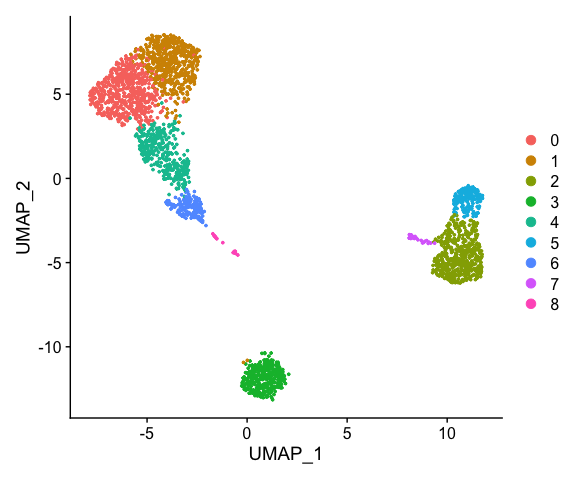

Running GLM-PCA on a Seurat Object
================
Compiled: July 15, 2020

This vignette demonstrates how to run GLM-PCA, which implements a
generalized version of PCA for non-normally distributed data, on a
Seurat object. If you use this, please cite:

> *Feature selection and dimension reduction for single-cell RNA-Seq
> based on a multinomial model*
> 
> F. William Townes, Stephanie C. Hicks, Martin J. Aryee & Rafael A.
> Irizarry
> 
> Genome Biology, 2019
> 
> doi: <https://doi.org/10.1186/s13059-019-1861-6>
> 
> GitHub: <https://github.com/willtownes/glmpca> CRAN:
> <https://cran.r-project.org/web/packages/glmpca/index.html>

Prerequisites to install:

  - [Seurat](https://satijalab.org/seurat/install)
  - [SeuratWrappers](https://github.com/satijalab/seurat-wrappers)
  - [SeuratData](https://github.com/satijalab/seurat-data)
  - [glmpca](https://github.com/willtownes/glmpca)
  - [scry](https://github.com/kstreet13/scry)

<!-- end list -->

``` r
library(Seurat)
library(SeuratData)
library(SeuratWrappers)
library(glmpca)
library(scry)
```

### GLM-PCA on PBMC3k

To learn more about this dataset, type `?pbmc3k`

``` r
InstallData("pbmc3k")
data("pbmc3k")

# Initial processing to select variable features
m <- GetAssayData(pbmc3k, slot = "counts", assay = "RNA")
devs <- scry::devianceFeatureSelection(m)
dev_ranked_genes <- rownames(pbmc3k)[order(devs, decreasing = TRUE)]
topdev <- head(dev_ranked_genes, 2000)

# run GLM-PCA on Seurat object. 
# Uses Poisson model by default
# Note that data in the counts slot is used
# We choose 10 dimensions for computational efficiency

ndims <- 10
pbmc3k <- RunGLMPCA(pbmc3k, features = topdev, L = ndims)
pbmc3k <- FindNeighbors(pbmc3k, reduction = 'glmpca', dims = 1:ndims, verbose = FALSE)
pbmc3k <- FindClusters(pbmc3k, verbose = FALSE)
pbmc3k <- RunUMAP(pbmc3k, reduction = 'glmpca', dims = 1:ndims, verbose = FALSE)
```

``` r
# visualize markers
features.plot <- c('CD3D', 'MS4A1', 'CD8A', 'GZMK', 'GZMB', 'FCGR3A')
DimPlot(pbmc3k)
```

<!-- -->

Do the learned clusters overlap with the original annotation?

``` r
with(pbmc3k[[]], table(seurat_annotations, seurat_clusters))
```

    ##                   seurat_clusters
    ## seurat_annotations   0   1   2   3   4   5   6   7   8
    ##       Naive CD4 T  168 484   0   3  42   0   0   0   0
    ##       Memory CD4 T 405  45   0   0  30   0   0   0   3
    ##       CD14+ Mono     0   0 469   0   0   8   0   3   0
    ##       B              0   0   0 344   0   0   0   0   0
    ##       CD8 T          7   0   0   0 254   0   9   0   1
    ##       FCGR3A+ Mono   0   0  12   0   0 150   0   0   0
    ##       NK             0   0   0   0   8   0 147   0   0
    ##       DC             0   0   2   2   0   0   1  27   0
    ##       Platelet       0   0   1   0   0   0   0   0  13

``` r
pbmc3k <- NormalizeData(pbmc3k, verbose = FALSE) 
FeaturePlot(pbmc3k, features.plot, ncol = 2)
```

<!-- -->
